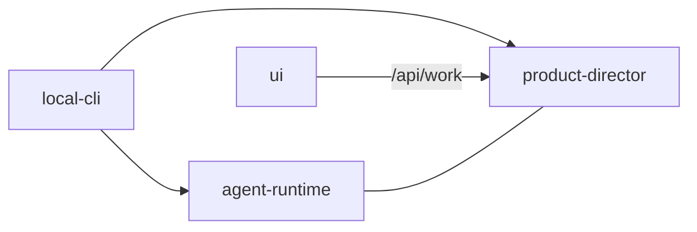

# meta-harness

Swap out agents at will.

A small kernel, plugins you can mix, and a CLI so the same agents run on a laptop or any box you already own. Cursor today, Codex tomorrow, Claude Code when it fits.

MIT licensed. Built on the [Agent Client Protocol](https://agentclientprotocol.com/).

```text
local-cli
  ├── agent-runtime        kernel, stores, HTTP, harnesses, minion tools
  ├── product-director     work queue, artifacts, “what to build next”
  └── ui                   dashboard for that work
```

| Package | npm |
| --- | --- |
| Kernel | [`@buildautomaton/agent-runtime`](https://www.npmjs.com/package/@buildautomaton/agent-runtime) |
| Work + artifacts | [`@buildautomaton/product-director`](https://www.npmjs.com/package/@buildautomaton/product-director) |
| CLI | [`@buildautomaton/local-cli`](https://www.npmjs.com/package/@buildautomaton/local-cli) |



Docs: [runtime](packages/agent-runtime/README.md) · [product director](packages/product-director/README.md) · [CLI](packages/local-cli/README.md) · [UI](packages/ui/README.md)

## Try it

```bash
npx @buildautomaton/local-cli --cwd /path/to/repo
```

From this repo:

```bash
pnpm install
pnpm build
pnpm test
```

```bash
pnpm --filter @buildautomaton/agent-runtime test
pnpm --filter @buildautomaton/product-director test
pnpm --filter @buildautomaton/local-cli test
pnpm --filter @buildautomaton/ui dev
```

Public packages publish under `@buildautomaton`. Bump versions, then `pnpm publish:packages`.

## License

MIT. See [LICENSE](LICENSE).
