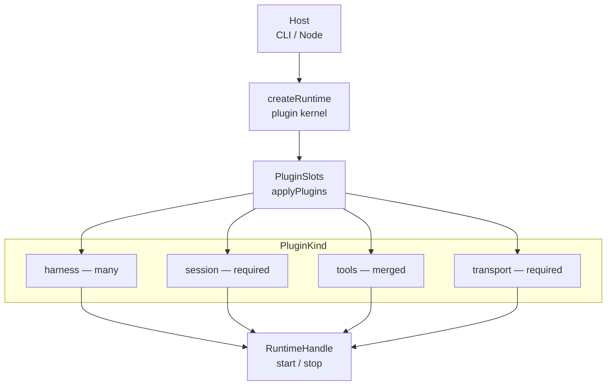

# @buildautomaton/meta-harness

Swap out agents at will.

The industry keeps hoping for one true agent. This repo is built for the other outcome: a polytheistic world of many harnesses, and a way to switch among them when the job, the price, or the model changes — or to let another agent do the picking.

It is an open-source meta-harness on the Agent Client Protocol (ACP): a small kernel, a catalog of plugins, and a CLI bridge so the same agents can run inside an ADE or on any compute you already own. Cursor today, Codex tomorrow, Claude Code when it fits — the host stays small. The plugins move.

## Plugin architecture

`@buildautomaton/agent-runtime` is a small kernel. A host (the CLI or a Node app) calls `createRuntime({ plugins })`. `applyPlugins` walks the array by `kind` and fills `PluginSlots`. Session and transport are required; harness and tools plugins are optional and compose additively. The ACP manager starts with an empty harness registry until a harness plugin (or `manager.registerHarness`) registers one.



Host supplies plugins. Kernel fills slots. Handle starts the transport.

### Four plugin kinds

| Kind | Slot write | Cardinality | Role |
| --- | --- | --- | --- |
| `harness` | Push onto `harnesses[]`; merge hooks and host methods | many | ACP agent types: detect, install, spawn, prompt |
| `session` | Set the backend, or push a `wrapBackend` layer | one backend; wraps stack | Create, append, patch, get, list session records |
| `transport` | Set transport (last plugin wins) | one | `start` / `stop` the host channel; receives the tool registry |
| `tools` | Push implementation; registries merge | many | `listTools` / `callTool` on the MCP CommandHost |

### Built-in plugins

| Factory | `name` | Notes |
| --- | --- | --- |
| `cursorHarnessPlugin` | `harness-cursor` | type `cursor-cli`. Detect, install (`CURSOR_API_KEY`), prompts |
| `codexHarnessPlugin` | `harness-codex` | type `codex-acp`. Detect, install (`OPENAI_API_KEY`), prompts |
| `kiroHarnessPlugin` | `harness-kiro` | type `kiro-acp`. Detect and prompts; no install helper |
| `claudeCodeHarnessPlugin` | `harness-claude-code` | type `claude-code`. Detect, install (`ANTHROPIC_API_KEY`), prompts |
| `opencodeHarnessPlugin` | `harness-opencode` | type `opencode`. Install only; prompts not wired yet |
| `diskSessionPlugin` | `session-disk` | `{id}.json` metadata + `{id}.jsonl` transcript. Sets the backend |
| `streamSessionPlugin` | `session-stream` | Wraps the current backend with in-memory `subscribe()` |
| `mcpTransportPlugin` | `transport-mcp` | JSON-RPC MCP over stdin/stdout. Default in `coreSet()` |
| `remoteTransportPlugin` | `transport-remote` | Control plane: POST `/register`, poll `/commands`, POST `/results` |
| `subagentToolsPlugin` | `tools-subagent` | `launch_subagent` and `get_session`; permissions auto-allow by default |

### Factory contract

Every factory takes one named-args object `{ options, hooks, implementation, runtime }`. There is no public `PluginApi`; core applies plugins with internal setup calls.

| Piece | Meaning |
| --- | --- |
| **options** | Config data: harness type and command, session dir, transport id, `remoteUrl` |
| **hooks** | Host notifications: `onSessionUpdate`, `onStart`, `resolvePermission`, … |
| **implementation** | How the plugin works: `createClient`, session CRUD, `start`/`stop`, `listTools`/`callTool` |
| **runtime** | `{ cwd, log }` at construction. `coreSet()` shares one context across the bundle |

A plugin object is `{ name, kind, options, hooks, implementation, runtime }`. `kind` is `harness | session | transport | tools`.

`coreSet()` is the CLI bundle: all five harness plugins, disk sessions, subagent tools, then MCP — or remote when `transport: "remote"`. If `backend: "stream"`, a stream wrap is stacked on disk so `subscribe()` sits on the file backend. Detect order for built-in harnesses: Cursor, Codex, Kiro, Claude Code, OpenCode.

## Project structure

- `packages/agent-runtime`: ACP runtime (`src/runtime/{core,harnesses,session,transport,tools}`) plus plugins (`src/plugins/`)
- `packages/cli`: thin CLI that registers `coreSet()` (MCP stdio or HTTP remote)

See [`packages/agent-runtime/README.md`](packages/agent-runtime/README.md) for factories, types, and custom plugins, and [`packages/cli/README.md`](packages/cli/README.md) for the CLI.

## Getting started

1. Install dependencies:

```bash
pnpm install
```

2. Build packages:

```bash
pnpm build
```

3. Run tests:

```bash
pnpm test
```

## Development

The project uses Turborepo to manage the workspace. Each package can be
developed independently or together.

### Agent runtime

```bash
pnpm --filter @buildautomaton/agent-runtime build
pnpm --filter @buildautomaton/agent-runtime test
pnpm --filter @buildautomaton/agent-runtime type-check
```

### CLI

```bash
pnpm --filter @buildautomaton/cli build
pnpm --filter @buildautomaton/cli test
```
