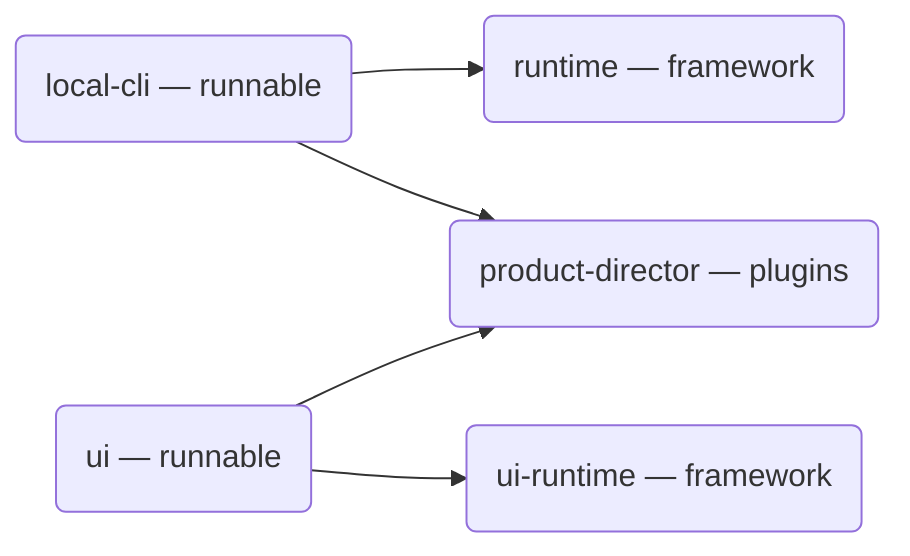

# meta-harness

Swap out agents at will.

meta-harness is a small open-source stack for running AI coding agents on machines you already own. Use Cursor today, Codex tomorrow, Claude Code when it fits. Built on the [Agent Client Protocol](https://agentclientprotocol.com/).

## What you can run today

Two packages are ready to run out of the box:

| Package | What it is |
| --- | --- |
| [Local CLI](./local-cli/) | A command you start on a repo. It listens for tools, serves a work queue, and drives local agents. |
| [UI](./ui/) | A dashboard app. Point it at the CLI and review what agents built. |

```bash
npx @buildautomaton/local-cli --cwd /path/to/repo
```

Then, in another terminal from this repo:

```bash
pnpm --filter @buildautomaton/ui dev
```

## Everything else is a framework

The other packages are building blocks. You compose them into your own runnable apps (or use the CLI and UI, which already do that for you).

| Package | Role |
| --- | --- |
| [Runtime](./runtime/) | Composes server plugins: stores, sessions, agents, tools, HTTP |
| [UI runtime](./ui-runtime/) | Composes UI plugins into a dashboard shell |
| [Product director](./product-director/) | Plugin packs for a work queue, review artifacts, and the matching UI |



## Try it from this repo

```bash
pnpm install
pnpm build
pnpm test
```

Public packages publish under `@buildautomaton`. Bump versions, then `pnpm publish:packages`.
