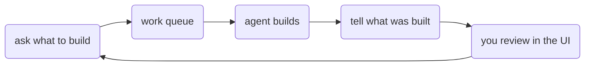

# Product director

Product director is how agents and humans share a **work queue**.

In plain terms: someone (or some agent) writes down what should be built next. An agent picks up that item, does the work, and comes back with a clear summary of what changed: APIs, screens, data models, and so on. You can review those results in the [UI](../ui/), answer questions, and queue follow-ups.

It is **not** a runnable app by itself. It is a set of plugins you plug into:

- the [runtime](../runtime/) (so the CLI can serve the queue and tools)
- the [UI runtime](../ui-runtime/) (so the dashboard can show the queue)

[Local CLI](../local-cli/) and [UI](../ui/) already compose those plugins for you.



## Sections

- [Runtime plugins](./runtime.md) — artifacts, the work store, and director tools
- [UI plugins](./ui.md) — columns dashboard for the queue

## Quick wire-up

```ts
import { createRuntime, coreSet } from '@buildautomaton/runtime';
import { productDirectorSet, directorHttpEndpoints } from '@buildautomaton/product-director';

const runtime = { cwd: process.cwd(), log: console.error };
await createRuntime({
  cwd: process.cwd(),
  plugins: [
    ...coreSet({ options: { cwd: process.cwd(), httpEndpoints: directorHttpEndpoints() }, runtime }),
    ...productDirectorSet({ runtime }),
  ],
});
```
