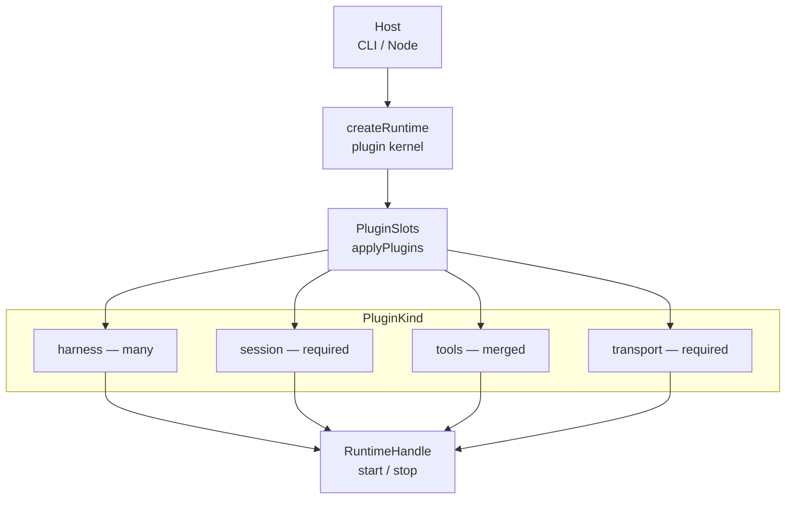
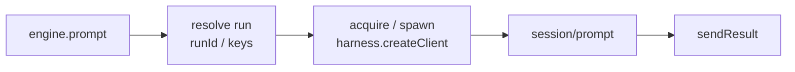

# @buildautomaton/agent-runtime

ACP agent runtime: a small kernel, four plugin kinds, and a catalog of built-in plugins. The host (CLI or Node) supplies plugins; the kernel fills slots and returns a handle.

```text
Host (CLI / Node)
  → createRuntime({ plugins })   // coreSet() or a custom list
  → applyPlugins → PluginSlots
  → RuntimeHandle (ACP engine + transport)
```

## Who this is for

| You are… | Use |
| --- | --- |
| Building a CLI or Node host around local coding agents | This library + `coreSet()` or individual plugins |
| Shipping the default MCP CLI | [`@buildautomaton/cli`](../cli) |

The **runtime** owns ACP subprocesses, prompt routing, and plugin interfaces. Hosts stay small: parse argv, pick plugins, call `createRuntime` / `runRuntime`.

## Install

```bash
pnpm install
pnpm --filter @buildautomaton/agent-runtime build
```

```ts
import { createRuntime, coreSet } from '@buildautomaton/agent-runtime';

const runtime = await createRuntime({
  cwd: process.cwd(),
  plugins: coreSet({ options: { cwd: process.cwd() } }),
});
```

Requires **Node.js 18+**. Plugins are also exported from `@buildautomaton/agent-runtime/plugins`.

## Plugin architecture

A host (the CLI or a Node app) calls `createRuntime({ plugins })`. `applyPlugins` walks the array by `kind` and fills `PluginSlots`. Session and transport are required; harness and tools plugins are optional and compose additively. The ACP engine starts with an empty harness registry until a harness plugin (or `engine.registerHarness`) registers one.



Host supplies plugins. Kernel fills slots. Handle starts the transport.

### Four plugin kinds

| Kind | Slot write | Cardinality | Role |
| --- | --- | --- | --- |
| `harness` | Push onto `harnesses[]`; merge hooks and host methods | many | ACP agent types: detect, install, spawn, prompt |
| `session` | Set the backend, or push a `wrapBackend` layer | one backend; wraps stack | Create, append, patch, get, list session records |
| `transport` | Set transport (last plugin wins) | one | `start` / `stop` the host channel; receives the tool registry |
| `tools` | Push implementation; registries merge | many | `listTools` / `callTool` on the MCP CommandHost |

A plugin object is `{ name, kind, options, hooks, implementation, runtime }`. `kind` is `harness | session | transport | tools`.

### Factory contract

Every factory takes one named-args object `{ options, hooks, implementation, runtime }`. Start with `src/types/`. Core applies plugins with internal setup calls — there is no public `PluginApi`.

| Piece | Meaning |
| --- | --- |
| **options** | Config data: harness type and command, session dir, transport id, `remoteUrl` |
| **hooks** | Host notifications: `onSessionUpdate`, `onStart`, `resolvePermission`, … |
| **implementation** | How the plugin works: `createClient`, session CRUD, `start`/`stop`, `listTools`/`callTool` |
| **runtime** | `{ cwd, log }` at construction. `coreSet()` shares one context across the bundle |

| Kind | Options | Hooks | Implementation |
| --- | --- | --- | --- |
| `harness` | `HarnessOptions` | `HarnessHooks` | `HarnessImplementation` |
| `session` | `DiskSessionOptions` / `StreamSessionOptions` | `SessionHooks` | `SessionImplementation` |
| `transport` | `McpTransportOptions` / `RemoteTransportOptions` | `TransportHooks` | `TransportImplementation` / `RemoteTransportImplementation` |
| `tools` | `ToolsOptions` | `ToolsHooks` | `ToolsImplementation` |

```ts
import {
  createRuntime,
  cursorHarnessPlugin,
  diskSessionPlugin,
  mcpTransportPlugin,
  minionToolsPlugin,
} from '@buildautomaton/agent-runtime';

const runtime = await createRuntime({
  cwd: process.cwd(),
  plugins: [
    cursorHarnessPlugin(),
    diskSessionPlugin({ options: { dir: '.harness/sessions' } }),
    minionToolsPlugin(),
    mcpTransportPlugin(),
  ],
});

await runtime.start();
```

`coreSet({ options, hooks, implementation, runtime })` is the CLI bundle: all five harness plugins, disk sessions, then MCP — or remote when `transport: "remote"`. `minionToolsPlugin` is included by default (`minionTools: false` skips it). Other `kind: 'tools'` plugins can be registered the same way — minion tools are not the tools layer. If `backend: "stream"`, a stream wrap is stacked on disk so `subscribe()` sits on the file backend. Detect order for built-in harnesses: Cursor, Codex, Kiro, Claude Code, OpenCode.

## ACP engine

The **ACP engine** (`AcpEngine`) lives on the runtime handle. It is not a second runtime. Harness plugins register agent types into it. Session plugins persist `acpSessionId`. Transport and tools sit beside it on the handle.

```text
createRuntime({ plugins })
  → applyPlugins → PluginSlots
  → buildClientHostHooks(session backend)   // persist + harness hooks
  → createAcpEngine
  → registerHarness from slots
  → RuntimeHandle { start, stop, engine }
```

`createRuntime` is the host path. `createAcpEngine` is the same engine without a transport — useful for tests or embedding. There is one engine factory.

### Prompt pipeline



`handlePrompt` → `resolvePromptRunContext` → `runPrompt` → `acquireAcpClient` → `spawnAcpClient` → `harness.createClient` → `dispatchPrompt`.

A harness plugin's `createClient` returns a live ACP subprocess. The engine reuses that subprocess when `cwd` and spawn identity still match; otherwise it disconnects and spawns again. Completions are fire-and-forget via `sendResult`; live updates go through `sendSessionUpdate`.

The chain is narrated in `src/runtime/acp/engine/prompt-pipeline.ts` (`handlePrompt` → `runPrompt` → `acquirePromptClient` → `dispatchPrompt`). MCP/remote transport never calls `prompt`; minion tools (or an embedding host) do.

Harnesses live on the engine's registry only. `registerHarness` does not write to a process-wide global.

### Identifiers

"Session" means three different things. Host ids are opaque to ACP; protocol ids belong to the subprocess; internal keys are map keys inside the engine.

| Id | Who owns it | Purpose |
| --- | --- | --- |
| `runId` | Host (**required** for prompts) | One prompt turn; cancel key |
| `sessionId` | Host | Logical session (session-plugin record id) |
| `scopeId` | Host (defaults to `sessionId`) | Isolates ACP subprocesses |
| `acpSessionId` | Agent subprocess | ACP protocol session; persist via host hooks |
| `acpAgentKey` | Engine (internal) | Spawn identity: type + argv + config |
| `acpSessionAgentKey` | Engine (internal) | `scopeId` + `acpAgentKey`; one live subprocess |

### Advanced: engine without a transport

```ts
import { randomUUID } from 'node:crypto';
import {
  createAcpEngine,
  BUILTIN_HARNESSES,
} from '@buildautomaton/agent-runtime';

const engine = await createAcpEngine({
  log: (line) => console.error(line),
  isShutdownRequested: () => false,
});
for (const harness of BUILTIN_HARNESSES) engine.registerHarness(harness);

engine.setPreferredHarnessType('cursor-cli');
engine.prompt({
  promptText: 'Summarize this repository in three bullets.',
  runId: randomUUID(),
  sessionId: 'dev',
  cwd: process.cwd(),
  sendResult: (result) => console.log(result.output ?? result.error),
  sendSessionUpdate: (payload) => console.error(JSON.stringify(payload)),
});
```

Prefer `createRuntime` for CLIs. `prompt()` is fire-and-forget; completion arrives through `sendResult`.

## Layout

| Folder | Holds |
| --- | --- |
| `src/types/` | Public plugin contracts: options, hooks, implementation |
| `src/runtime/core/` | Plugin kernel: `createRuntime`, `applyPlugins`, `PluginSlots`, `buildClientHostHooks` |
| `src/runtime/acp/` | ACP engine, subprocess lifecycle, clients, keys |
| `src/runtime/harnesses/` | Harness catalog: registry, discovery, install |
| `src/runtime/session/` | Session runtime helpers |
| `src/runtime/transport/` | Transport runtime helpers |
| `src/runtime/tools/` | Tools runtime helpers |
| `src/runtime/notify/` | In-process minion event hub used by tools/transport |
| `src/plugins/` | `coreSet()` plus one folder per plugin (`harnesses/cursor`, `session/disk`, `tools/minion`, `transport/mcp`, …) |

`src/types/` is plugin contracts. ACP public types (`AcpEngine`, `AcpClientHandle`, session kinds) live under `src/runtime/acp/` and are re-exported from the package root.

`createRuntime` does not register plugins on its own. It requires a **session** plugin and a **transport** plugin. The `session` kind writes `backend` and/or `backendWraps` (`wrapBackend`).

### Glossary

Three folders are named “harness.” “Session” and “transport” each mean two things. Use this table when reading the code.

| Term | Meaning |
| --- | --- |
| **Harness plugin** | Catalog adapter in `plugins/harnesses/<agent>` (`name` like `harness-cursor`) |
| **Agent type** | Registry key (`cursor-cli`, `codex-acp`) — `HarnessOptions.type` |
| **`AgentHarness`** | Options + implementation on the engine registry |
| **ACP client** | Live subprocess handle (`AcpClientHandle`) |
| Host **`sessionId`** | Session-plugin record id |
| **`acpSessionId`** | ACP protocol session id from the agent |
| **`AcpClientHandle.sessionId`** | Same as `acpSessionId` (protocol id, not the host record) |
| **`HostTransport`** | MCP/remote host channel (`start` / `stop`) |
| **`AcpSessionTransport`** | ACP wire: initialize / newSession / prompt |

`plugins/harnesses` = per-agent adapters. `runtime/acp` = engine + wire + clients. `runtime/harnesses` = registry, discovery, install.

## Available plugins

Located in `src/plugins/`.

### Harnesses

Each agent type is its own plugin. `coreSet()` / `coreHarnessPlugins()` include all of them:

| Plugin | `name` | `type` | Display name | Detect | Install | Prompts |
| --- | --- | --- | --- | --- | --- | --- |
| `cursorHarnessPlugin` | `harness-cursor` | `cursor-cli` | Cursor | yes | yes (`CURSOR_API_KEY`) | yes |
| `codexHarnessPlugin` | `harness-codex` | `codex-acp` | Codex | yes | yes (`OPENAI_API_KEY`) | yes |
| `claudeCodeHarnessPlugin` | `harness-claude-code` | `claude-code` | Claude Code | yes | yes (`ANTHROPIC_API_KEY`) | yes |
| `kiroHarnessPlugin` | `harness-kiro` | `kiro-acp` | Kiro | yes | no | yes |
| `opencodeHarnessPlugin` | `harness-opencode` | `opencode` | OpenCode | no | yes | not yet (install-only) |

### Sessions

- **`diskSessionPlugin({ options: { dir } })`** (`session-disk`) — `{id}.jsonl` event log while running; compact at the end to `{id}.md` messages and a structured `log` on `{id}.json`. Default dir: `<cwd>/.harness/sessions`.
- **`streamSessionPlugin()`** (`session-stream`) — wraps the current backend with in-memory `subscribe()` via `wrapBackend` (does not replace disk).

### Transports

- **`mcpTransportPlugin()`** (`transport-mcp`) — JSON-RPC MCP over localhost HTTP (Streamable HTTP POST + SSE GET). Options: `host`, `port`, `path` (defaults `127.0.0.1:3333/mcp`).
- **`remoteTransportPlugin({ implementation })`** (`transport-remote`) — register with a control plane. `createHttpRemoteAdapter(url)` POSTs `/register`, polls `/commands`, POSTs `/results`.

### Tools

Any plugin with `kind: 'tools'` can register MCP tools via `ToolsImplementation` (`listTools` / `callTool`). Optional `instructions()` and `prompts()` supply MCP initialize instructions and `prompts/list` entries. The MCP transport does not contribute that text. Multiple tools plugins merge. **`minionToolsPlugin()`** (`tools-minion`) is one such plugin:

`spawn_minion` — `{ harness, prompt, model? }` waits until the minion finishes (streams MCP progress on the same tool call) and returns compacted agent messages. There is no background parameter. For several minions, call `spawn_minion` multiple times in one turn (each call waits on its own). Permission requests arrive as MCP notifications and elicitation while the call is still in flight; the coordinator applies its current permission mode via `resolve_minion_request` (or seeks the user if that mode would) without waiting for other minions.

`await_minion` — block until a minion finishes, with live progress. `spawn_minion` already waits; use this only if a spawn already returned. Do not poll.

`get_minion_context` — working directory and harness list minions inherit.

`get_minion` / `get_minion_transcript` — status plus compacted **agent messages only** (no tool output or reasoning). Permission and auth requests use the same shape: `title`, `message`, and options with human-readable `label` plus `optionId`.

`resolve_minion_request` — approve/deny a minion permission (pass `optionId` or the label, e.g. Allow all) or store a provider API token.

While a spawn/await tool call is in flight, a short human-readable tool-call summary is sent about every 10s as MCP `notifications/progress` (not raw JSON). Permission events use `notifications/message` and `elicitation/create`; if the client supports sampling, the coordinator's current permission mode is applied first. Missed or cancelled prompts are redelivered until resolved.

On disk, a running session appends `{id}.jsonl`. When it ends, that log is compacted to `{id}.md` (concatenated agent messages) and a structured `log` on `{id}.json` (messages, thoughts, and tool calls). The JSONL file is then removed.

Override permission handling with `hooks.resolvePermission` when you do not want to wait for the coordinator.

## Custom plugins

```ts
const myTools: AgentRuntimePlugin = {
  name: 'my-tools',
  kind: 'tools',
  implementation: {
    listTools: (_ctx) => [
      { name: 'ping', description: 'Health check', inputSchema: { type: 'object' } },
    ],
    callTool: async (name, _args, _ctx) => ({
      content: [{ type: 'text', text: name === 'ping' ? 'ok' : 'unknown' }],
    }),
  },
};
```

Or use a factory:

```ts
cursorHarnessPlugin({
  hooks: { onSessionUpdate: (e) => console.error(e) },
  implementation: { getAccessPort: () => 8080 },
});
```

Same `type` on `registerHarness` replaces an existing harness.

## API overview

```ts
createRuntime(options: RuntimeOptions): Promise<RuntimeHandle>
runRuntime(options: RuntimeOptions): Promise<void>
coreSet({ options, hooks?, implementation?, runtime? }): AgentRuntimePlugin[]
createAcpEngine(options: AcpEngineOptions): Promise<AcpEngine>
```

**Runtime options:** `cwd`, `plugins?`, `log?`, `isShutdownRequested?`.

**Runtime handle:** `start` / `stop` / `engine`. `start` opens the host channel; it does not send prompts.

**ACP engine:** `registerHarness` / `getHarness` / `listHarnesses` / `discoverAgents` / `probeCapabilities` / `setPreferredHarnessType` / `prompt` / `cancelRun` / `isRegisteredRun` / `resolveRequest` / `disconnect`.

`createRuntime` wires session persist through `buildClientHostHooks`, then calls `createAcpEngine`. Engine-only options (`reportAgentCapabilities?`, `clientHostHooks?`, `clientInfo?`) are on `AcpEngineOptions`, not `RuntimeOptions`.

## Development

```bash
pnpm --filter @buildautomaton/agent-runtime build
pnpm --filter @buildautomaton/agent-runtime type-check
pnpm --filter @buildautomaton/agent-runtime test
```

Keep new source files under **100 lines** (see root `AGENTS.md`).

Internal imports use path aliases instead of long `../` chains: `@/types/…`, `@runtime/…`, `@plugins/…`. (`@types/…` is reserved by TypeScript for DefinitelyTyped.) Same-folder `./` imports stay relative.

## Related packages

- [`@buildautomaton/cli`](../cli) — MCP/remote CLI that registers `coreSet()`

## License

Private package in the [@buildautomaton/meta-harness](https://github.com/buildautomaton/meta-harness) monorepo.
