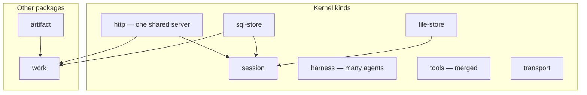

# @buildautomaton/agent-runtime

Kernel for running coding agents over ACP. You pass plugins in; it wires them and gives you a handle.

```text
Host (CLI / Node)
  → createRuntime({ plugins })
  → slots filled by kind
  → handle.start()     HTTP, stdio, or remote
```

| You want… | Use |
| --- | --- |
| A library around local agents | This package + `coreSet()` |
| The default binary | [`@buildautomaton/local-cli`](../local-cli) |
| A work queue and review artifacts | [`@buildautomaton/product-director`](../product-director) |

## Install

```bash
npm install @buildautomaton/agent-runtime
```

```ts
import { createRuntime, coreSet } from '@buildautomaton/agent-runtime';

const runtime = await createRuntime({
  cwd: process.cwd(),
  plugins: coreSet({ options: { cwd: process.cwd() } }),
});
await runtime.start();
```

Node 18+. Plugins also export from `@buildautomaton/agent-runtime/plugins`.

## How plugins fit

The kernel knows a few kinds. Other packages can add new kinds; the kernel still indexes them. Only the plugin that *uses* a new kind has to know its shape.



| Kind | Many? | What it does |
| --- | --- | --- |
| `file-store` | one | Files on disk |
| `sql-store` | one | Shared SQLite. Plugins inject their own migrations |
| `http` | one | One server. Plugins add routes and websockets |
| `session` | one (+ wraps) | Session records. Can use file + SQL + HTTP |
| `harness` | many | Agent types: detect, install, spawn, prompt |
| `tools` | many | MCP tools; lists merge |
| `transport` | one | stdio or remote `start` / `stop` (HTTP is the `http` kind) |

Anything else (`work`, `artifact`, …) lands in `slots.byKind` and `slots.extras`. A plugin may also set `sqlMigrations`, `createFromStores`, and `contributeHttp`.

Each factory takes `{ options, hooks, implementation, runtime }`.

`coreSet()` is the default bundle: both stores, five harnesses, disk sessions, minion tools, then HTTP (or stdio / remote). Skip minion tools with `minionTools: false`. Detect order: Cursor, Codex, Kiro, Claude Code, OpenCode.

```ts
createRuntime({
  cwd: process.cwd(),
  plugins: [
    cursorHarnessPlugin(),
    diskSessionPlugin({ options: { dir: '.harness/sessions' } }),
    minionToolsPlugin(),
    httpTransportPlugin(),
  ],
});
```

Need a session plugin and a transport (or `http`) plugin.

## Stores and HTTP

```text
.harness/
  sessions/     file-store  (and optional SQL mirror)
  work.sqlite   sql-store   (shared; each plugin migrates its own tables)
```

SQL migrations follow the CLI pattern: a `__migrations` table, names scoped per plugin, order guaranteed *inside* that plugin only.

HTTP is one process. MCP tools default to `/mcp`. Other plugins mount beside it:

```ts
httpTransportPlugin({
  options: {
    endpoints: [
      { kind: 'tools', path: '/mcp' },
      { plugin: 'session-disk', path: '/api' },
      { plugin: 'work-sqlite', path: '/api' },
    ],
  },
});
```

`directorHttpEndpoints()` in product-director is the work + session mounts.

| Transport plugin | Channel |
| --- | --- |
| `httpTransportPlugin` | Localhost HTTP + websockets |
| `stdioTransportPlugin` | MCP on stdin/stdout |
| `remoteTransportPlugin` | Register with a control plane |

## Harnesses

| Plugin | Type | Install |
| --- | --- | --- |
| `cursorHarnessPlugin` | `cursor-cli` | `CURSOR_API_KEY` |
| `codexHarnessPlugin` | `codex-acp` | `OPENAI_API_KEY` |
| `claudeCodeHarnessPlugin` | `claude-code` | `ANTHROPIC_API_KEY` |
| `kiroHarnessPlugin` | `kiro-acp` | detect only |
| `opencodeHarnessPlugin` | `opencode` | install; prompts later |

## Sessions

- **`diskSessionPlugin`** — `{id}.jsonl` while running; compact to `{id}.json` + `{id}.md`. Default dir `<cwd>/.harness/sessions`. Uses file-store, can mirror to SQL, can serve `/api/sessions`.
- **`streamSessionPlugin`** — wrap for in-memory `subscribe()`; does not replace disk.

## Minion tools

`minionToolsPlugin` adds MCP tools: `spawn_minion`, `await_minion`, `get_minion`, `get_minion_transcript`, `get_minion_context`, `resolve_minion_request`. Spawn waits until that minion finishes. Permissions come in as MCP elicitation while the call is still open.

## ACP engine

The engine lives on the handle. Harness plugins register agent types. Session plugins persist `acpSessionId`. Tools and transport sit next to it.

```text
prompt → pick run → spawn or reuse subprocess → session/prompt → sendResult
```

Host ids vs agent ids:

| Id | Owner | Meaning |
| --- | --- | --- |
| `runId` | you | One prompt turn; cancel key |
| `sessionId` | you | Session record |
| `acpSessionId` | agent | ACP protocol session |

`createAcpEngine` is the same engine with no transport (tests / embed). Prefer `createRuntime` for a CLI.

## Custom plugin

```ts
const ping: AgentRuntimePlugin = {
  name: 'my-tools',
  kind: 'tools',
  implementation: {
    listTools: () => [{ name: 'ping', description: 'Health check', inputSchema: { type: 'object' } }],
    callTool: async (name) => ({
      content: [{ type: 'text', text: name === 'ping' ? 'ok' : 'unknown' }],
    }),
  },
};
```

Or wrap a built-in: `cursorHarnessPlugin({ hooks: { onSessionUpdate: console.error } })`.

**Handle:** `start` / `stop` / `engine`. `start` opens the channel; it does not send prompts.

Keep source files under 100 lines. Internal imports: `@/types/…`, `@runtime/…`, `@plugins/…`.

## License

MIT. See [LICENSE](LICENSE).
