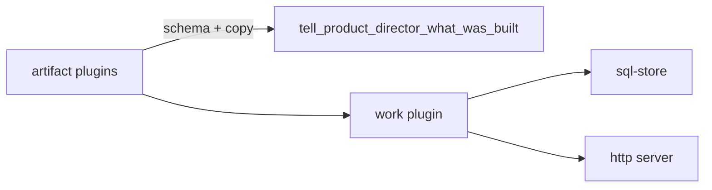

# @buildautomaton/product-director

Work queue and review artifacts. Agents **ask what to build next** and **tell what was built**.

Uses the runtime **sql-store** and **http** plugins only (not file storage). MIT licensed.

```text
plugins/
  runtime/
    artifact plugins     ui, api, algorithm, dataModel, …
    work plugin          queue + SQL migrations + /api/work
    director tools       ask / tell / interview
  ui/
    work surfaces        columns dashboard for the queue
```



Register next to `coreSet()`:

```ts
import { createRuntime, coreSet } from '@buildautomaton/runtime';
import { productDirectorSet, directorHttpEndpoints } from '@buildautomaton/product-director';

const runtime = { cwd: process.cwd(), log: console.error };
await createRuntime({
  cwd: process.cwd(),
  plugins: [
    ...coreSet({ options: { cwd: process.cwd(), httpEndpoints: directorHttpEndpoints() }, runtime }),
    ...productDirectorSet({ runtime }),
  ],
});
```

## Tools

| Tool | Does |
| --- | --- |
| `ask_product_director_what_to_build_next` | Next queued work + `sessionId` |
| `tell_product_director_what_was_built` | Store artifacts from **registered** artifact plugins |
| `ask_product_director_interview_questions` | Relentless interview on a draft |

Tell-tool fields, descriptions, and agent instructions are composed from artifact plugins. Add a plugin, and the tool grows. Remove one, and that kind disappears.

Built-in kinds: **ui**, **api**, **algorithm**, **dataModel**, **moduleStructure**, **backend**, **outline**.

## UI

Dashboard plugins for [`@buildautomaton/ui-runtime`](../ui-runtime). The Vite app is [`@buildautomaton/ui`](../ui).

```ts
import { createUi } from '@buildautomaton/ui-runtime';
import { productDirectorUiSet } from '@buildautomaton/product-director/ui';

const { App } = createUi({ plugins: productDirectorUiSet() });
```

## HTTP

Same server as MCP. Default mounts:

```text
/api/work           queue
/api/artifacts      submissions + answers
/api/assets         images for previews
/api/work/events    websocket
```

## SQL

The work plugin injects its own migrations into the shared sql-store. Order is guaranteed inside this plugin; other plugins migrate on their own timeline.

## License

MIT. See [LICENSE](LICENSE).
